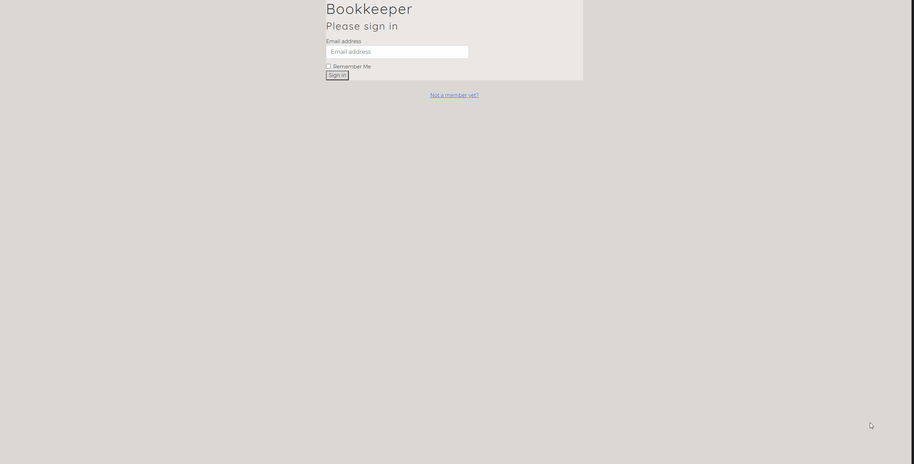

## book-keeper-api

### Prerequisites

1. Install json-server

```sh
npm i json-server
```

<p style="font-size: 20px; font-weight: 500;">• Bookkeeper Repository</p>

<a href="https://github.com/luciidlou/book-keeper" target="_blank"></a>

### Installation

<p style="font-size: 16px; font-weight: 500;">In order to demo the Bookkeeper application, you will need to clone this repository and login as an existing user.</p>


1. Clone this repository and change to the directory in the terminal.

```sh
git clone git@github.com:luciidlou/book-keeper-api.git
cd book-keeper-api
```

2. Run the server.

```sh
json-server -w database.json -p 8088
```

3. Launch the application from a new terminal tab (step 3 from installation portion of book-keeper readme)

```sh
cd book-keeper
npm start
```
### Demo login credentials
- Login with demo@email.com


## Author Info

- Github - [luciidlou](https://github.com/luciidlou)
- LinkedIn - [Alex Lewis](https://www.linkedin.com/in/alex-lewis22/)